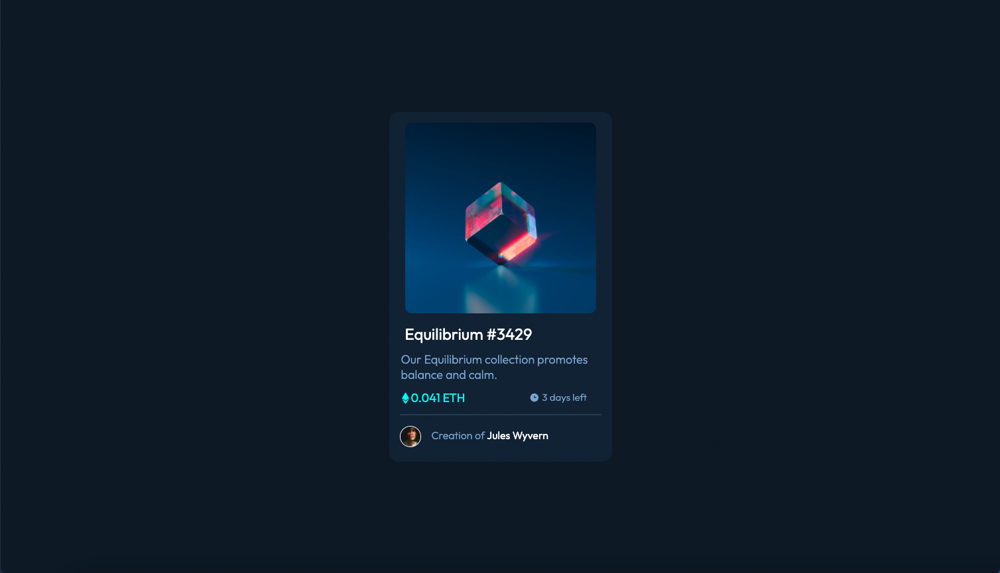
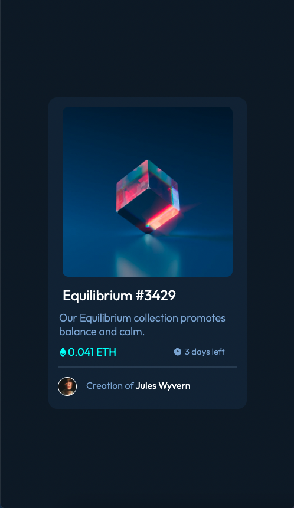

# Frontend Mentor - NFT preview card component solution

This is a solution to the [NFT preview card component challenge on Frontend Mentor](https://www.frontendmentor.io/challenges/nft-preview-card-component-SbdUL_w0U). Frontend Mentor challenges help you improve your coding skills by building realistic projects. 

## Table of contents

- [Overview](#overview)
  - [The challenge](#the-challenge)
  - [Screenshot](#screenshot)
  - [Links](#links)
  - [Built with](#built-with)
  - [What I learned](#what-i-learned)
  - [Useful resources](#useful-resources)
- [Author](#author)
- [Acknowledgments](#acknowledgments)

## Overview
This is my first React app. it was bootstraped with create react app. I have started learning react via this tutorial;

https://www.youtube.com/watch?v=iZhV0bILFb0&t=13750s

I decided it would be best to start with a newbie project and work my way back up. Coonsidering it is very basic it wasn't very difficult but I am begining to get React's basic concepts. 

### The challenge

Users should be able to:

- View the optimal layout depending on their device's screen size
- See hover states for interactive elements

### Screenshot

### Links

- Solution URL: https://github.com/timbosTours/Frontend-Mentor-nft-preview--card
- Live Site URL: https://nft-preview-card-tt.netlify.app/

### Built with

- Semantic HTML5 markup
- CSS custom properties
- Mobile-first workflow
- [React](https://reactjs.org/) - JS library

### What I learned

I learnt the basics of setting up a React app, an introduction too JSX and how to host a React app on netlify.

### Useful resources

- [React Tutorial](https://www.youtube.com/watch?v=iZhV0bILFb0&t=13750s) - This is the tutorial I am doing, I have done a few of Johns courses and would highly recommend.

## Author

- Frontend Mentor - [@timbosTours](https://www.frontendmentor.io/profile/timbosTours)
- Twitter - [@timbosTours](https://www.twitter.com/timbosTours)

## Acknowledgments

Great big thanks to anyone who checked out my app. Any feedback would be greatly appreciated.

Thank you too Frontend Mentor for the fanctastic learning resources.

